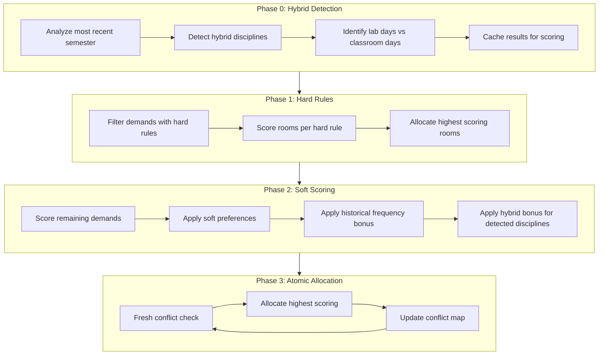
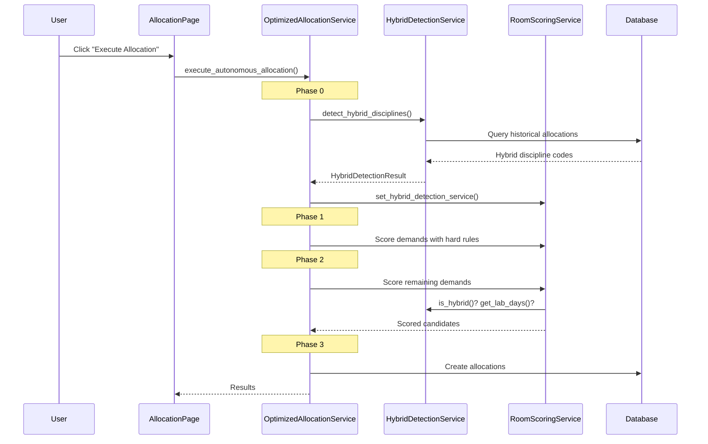

# Updated Allocation Scoring System

> Complete documentation of the room allocation pipeline including the new **Phase 0: Hybrid Discipline Detection**.

## Overview

The allocation system uses a multi-phase approach to optimally assign rooms to course demands based on rules, preferences, and historical data. The system now includes an enhanced Phase 0 that automatically detects **hybrid disciplines** (those requiring both classroom and lab/specialized room allocations).

---

## System Architecture



---

## Phase 0: Hybrid Discipline Detection (NEW!)

### Purpose

Automatically detect disciplines that historically have been allocated to both:
- **Regular classrooms** (`tipo_sala_id = 2`)
- **Specialized rooms** (labs, auditoriums, etc. - `tipo_sala_id ≠ 2`)

### Detection Criteria

A discipline is classified as **hybrid** if, in the most recent semester:
1. It has allocations in **2+ different rooms**
2. At least **one room is NOT** a regular classroom

### Implementation

```python
# Detection query (simplified)
SELECT DISTINCT d.codigo_disciplina
FROM alocacoes_semestrais a
JOIN demandas d ON a.demanda_id = d.id
JOIN salas s ON a.sala_id = s.id
WHERE a.semestre_id = :most_recent_semester
GROUP BY d.codigo_disciplina
HAVING 
    COUNT(DISTINCT a.sala_id) >= 2
    AND MAX(CASE WHEN s.tipo_sala_id != 2 THEN 1 ELSE 0 END) = 1
```

### Per-Day Lab Detection

For each detected hybrid discipline:
- **Lab Days**: Days that historically used non-classroom rooms
- **Classroom Days**: Days that only used regular classrooms

This information is used during scoring to boost the appropriate room type for each day.

### Related Files

| File | Purpose |
|------|---------|
| [hybrid_discipline_service.py](file:///home/bgeneto/github/ensalamento-fup/src/services/hybrid_discipline_service.py) | Main detection service |
| [alocacao.py](file:///home/bgeneto/github/ensalamento-fup/src/repositories/alocacao.py) | Repository detection queries |

---

## Phase 1: Hard Rules Allocation

### Purpose

Allocate demands that have **mandatory constraints** (priority = 0 rules).

### Rule Types

| Rule Type | Description | Example |
|-----------|-------------|---------|
| `DISCIPLINA_SALA` | Must use specific room | "Only B203" |
| `DISCIPLINA_TIPO_SALA` | Must use specific room type | "Must be a Lab" |
| `DISCIPLINA_CARACTERISTICA` | Must have specific characteristic | "Projector required" |

### Scoring

Each satisfied hard rule adds **+20 points** (`HARD_RULE_COMPLIANCE`).

> [!IMPORTANT]
> If ANY hard rule fails, the room receives 0 points and soft preferences are not checked.

---

## Phase 2: Soft Scoring

### Purpose

Score all remaining demands based on soft preferences, historical frequency, and hybrid bonuses.

### Scoring Components

| Component | Points | Description |
|-----------|--------|-------------|
| **Capacity Adequate** | +3 | Room capacity ≥ enrolled students |
| **Hard Rule Compliance** | +20 each | Mandatory rule satisfaction |
| **Preferred Room** | +4 | Professor's preferred room |
| **Preferred Characteristic** | +4 | Professor's preferred room feature |
| **Historical Frequency** | +4 per allocation | Past allocations of discipline to room (max 80) |
| **Hybrid Room Type Match** | +15 | Room type matches hybrid day pattern |

### Total Score Formula

```python
total_score = (
    capacity_points 
    + hard_rules_points 
    + soft_preference_points 
    + historical_frequency_points
    + hybrid_bonus_points  # NEW!
)
```

### Hybrid Bonus Logic

For hybrid disciplines, the scoring service applies a **+15 point bonus** when:
- Room is a **lab** AND day is a **historical lab day**
- Room is a **classroom** AND day is a **historical classroom-only day**

This ensures that:
- Lab time slots naturally score higher for lab rooms
- Classroom time slots naturally score higher for regular classrooms

---

## Phase 3: Atomic Allocation

### Purpose

Perform the actual allocation with **fresh conflict detection** for each demand.

### Process

1. Get highest-scoring room candidate
2. Perform fresh conflict check against current database state
3. If no conflict, create allocation records
4. Update in-memory conflict map for next iteration
5. Repeat for next demand

---

## Configuration

### Scoring Weights

All scoring weights are configurable via:
- **Default values**: [scoring_defaults.json](file:///home/bgeneto/github/ensalamento-fup/data/scoring_defaults.json)
- **User overrides**: `data/scoring_config.json`
- **Python config**: [scoring_config.py](file:///home/bgeneto/github/ensalamento-fup/src/config/scoring_config.py)

```json
{
    "weights": {
        "CAPACITY_ADEQUATE": 3,
        "HARD_RULE_COMPLIANCE": 20,
        "PREFERRED_ROOM": 4,
        "PREFERRED_CHARACTERISTIC": 4,
        "HISTORICAL_FREQUENCY_PER_ALLOCATION": 4,
        "HISTORICAL_FREQUENCY_MAX_CAP": 80,
        "HYBRID_ROOM_TYPE_MATCH": 15
    }
}
```

---

## UI Integration

### Manual Allocation Warnings

The demand queue now shows enhanced warnings for hybrid disciplines:

| Warning Type | Indicator | Source |
|--------------|-----------|--------|
| **HYBRID (Confirmed)** | 🧪 `Disciplina HÍBRIDA - requer laboratório em alguns dias` | Phase 0 detection |
| **May require lab** | `Disciplina pode necessitar de laboratório` | Name regex match |

### Related Files

- [alloc_queue.py](file:///home/bgeneto/github/ensalamento-fup/pages/components/alloc_queue.py) - `_check_rule_warnings()` function

---

## Key Services

### RoomScoringService

**Path**: [room_scoring_service.py](file:///home/bgeneto/github/ensalamento-fup/src/services/room_scoring_service.py)

The **single source of truth** for all scoring logic. Used by both:
- `OptimizedAutonomousAllocationService` (automatic allocation)
- `ManualAllocationService` (manual allocation with suggestions)

Key methods:
- `score_room_candidates_for_demand()` - Full demand scoring
- `score_rooms_for_block_group()` - Per-day scoring for partial allocation
- `_calculate_hybrid_bonus()` - NEW! Hybrid room type matching

### HybridDisciplineDetectionService

**Path**: [hybrid_discipline_service.py](file:///home/bgeneto/github/ensalamento-fup/src/services/hybrid_discipline_service.py)

Detects and caches hybrid discipline information.

Key methods:
- `detect_hybrid_disciplines()` - Run detection phase
- `is_hybrid()` - Check if discipline is hybrid
- `get_lab_days_for_discipline()` - Get lab days for a discipline
- `get_hybrid_info()` - Get full hybrid info for a discipline

### OptimizedAutonomousAllocationService

**Path**: [optimized_autonomous_allocation_service.py](file:///home/bgeneto/github/ensalamento-fup/src/services/optimized_autonomous_allocation_service.py)

Main allocation service with all phases.

Key methods:
- `_execute_hybrid_detection_phase()` - NEW! Phase 0
- `execute_autonomous_allocation()` - Full allocation pipeline
- `execute_autonomous_allocation_partial()` - Partial allocation with per-day scoring

---

## Data Flow



---

## Example Scoring Breakdown

### Hybrid Discipline on a Lab Day

```
Room: Laboratório de Informática 1
Day: Segunda-feira (lab day)

Scoring:
  ✅ Capacity adequate:        +3
  ✅ Hard rules passed:        +20
  ✅ Professor preference:     +4
  📈 Historical frequency (2x): +8
  🧪 Hybrid lab day match:     +15
  ────────────────────────────
  TOTAL:                       50 points
```

### Same Discipline on a Classroom Day

```
Room: Laboratório de Informática 1
Day: Quarta-feira (classroom day)

Scoring:
  ✅ Capacity adequate:        +3
  ✅ Hard rules passed:        +20
  ✅ Professor preference:     +4
  📈 Historical frequency (0x): +0   ← Different day!
  ❌ Hybrid mismatch:          +0   ← Lab room on classroom day
  ────────────────────────────
  TOTAL:                       27 points
```

The classroom will score **higher** on classroom days due to the hybrid bonus.

---

## References

- **RF-006**: Autonomous Allocation Algorithm specification
- **RF-006.6**: Historical frequency bonus requirement
- Previous documentation: [ALLOCATION SCORING SYSTEM.md](file:///home/bgeneto/github/ensalamento-fup/docs/ALLOCATION%20SCORING%20SYSTEM.md)
